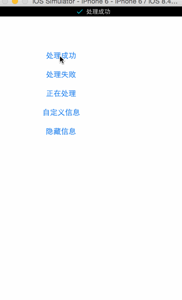

# JWShowStatusBarIndicator
用于显示控制栏的指示条，简单易用




```objc
/**
 * 显示一般信息和图片
 */
+ (void)showMessage:(NSString *)msg image:(UIImage *)image;
/**
 * 显示一般信息
 */
+ (void)showMessage:(NSString *)msg;
/**
 * 显示成功信息
 */
+ (void)showSuccess:(NSString *)msg;
/**
 * 显示失败信息
 */
+ (void)showError:(NSString *)msg;
/**
 * 显示正在处理的信息
 */
+ (void)showLoading:(NSString *)msg;
/**
 * 隐藏自定义的StatusBar
 */
+ (void)hide;
```
